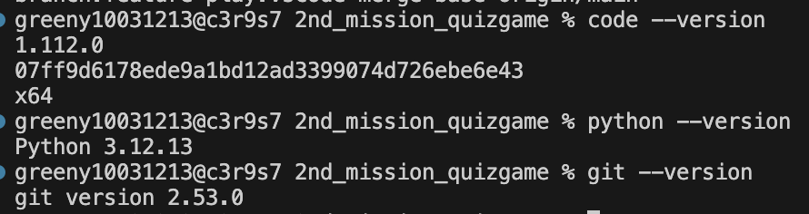

# 🎯 나만의 퀴즈 게임 (Python & Git 프로젝트)

## 1. 프로젝트 개요
터미널 환경에서 동작하는 콘솔 기반의 퀴즈 게임 프로그램입니다. Python의 기본 문법과 클래스(class)를 활용하여 객체 지향적으로 코드를 구조화하였으며, JSON 파일 시스템을 이용해 데이터를 영구적으로 저장하고 불러옵니다.  Git 브랜치 활용과 클론(Clone) 실습을 통해 버전 관리와 협업의 기초를 다졌습니다.

## 2. 퀴즈 주제 선정 이유
* **주제:** 파이썬 기초 문법 및 Git 트러블슈팅

* **이유:** 코디세이 미션을 수행하며 직접 겪었던 여러 `error` 상황들을 퀴즈로 만들어, 프로그래밍 기초 개념을 확실히 복습하고 실제 발생할 수 있는 오류에 대한 대처 능력을 기르기 위해 선정했습니다.


## 3. 실행 방법 (How to Run)


0) **개발환경설정**: 이 프로그램을 실행하기 위해서는 Python이 설치되어 있어야 합니다.  
```bash
Editor: Visual Studio Code (v1.112.0) ✨

Python: Python 3.12.13

Git: git version 2.53.0
```

1) **프로젝트 복제**: 터미널에서 아래 명령어를 입력하여 저장소를 복제합니다.  
```bash
$ git clone https://github.com/solbao-dev/2nd_mission_quizgame.git
```

2) **폴더 이동**: 복제된 프로젝트 폴더로 이동합니다.  
```bash
$ cd 2nd_mission_quizgame
```
3) **프로그램 실행**: 아래 명령어를 입력하여 퀴즈 게임을 시작합니다.  
```bash
$ python main.py
```


## 4. 기능 목록
- [x] **퀴즈 풀기**: 저장된 퀴즈를 순서대로 풀고 정답 여부와 최종 점수를 확인합니다.
- [x] **퀴즈 추가**: 새로운 문제, 선택지 4개, 정답 번호를 직접 입력하여 파일에 등록합니다.
- [x] **퀴즈 목록**: 현재 프로그램에 등록된 모든 퀴즈 목록을 조회합니다.
- [x] **점수 확인**: 역대 플레이 기록 중 최고 점수를 확인합니다.
- [x] **데이터 저장**: 프로그램을 종료해도 추가한 퀴즈와 최고 점수가 `state.json`에 유지됩니다.
- [x] **예외 처리**: 숫자 대신 문자를 입력하거나 강제 종료(Ctrl+C) 시에도 안전하게 종료됩니다.

## 5. 파일 구조 (File Structure)

```text
2nd_mission_quizgame/
├── docs/                      # 문서 및 스크린샷 폴더
│   └── screenshots/           # 실행 화면 캡처 이미지
├── main.py                    # 프로그램 메인 실행 파일
├── state.json                 # 퀴즈 및 최고 점수 데이터 저장 파일
├── .gitignore                 # Git 추적 제외 설정 파일
└── README.md                  # 프로젝트 가이드 및 설명서
```

## 6. 데이터 파일 설명 (state.json)
- **경로:** 프로젝트 최상위 폴더 (`/state.json`)
- **역할:** 프로그램 종료 시 사용자가 추가한 퀴즈 데이터와 점수가 날아가지 않도록 안전하게 보존합니다.
- **스키마 구조:**
  - `quizzes`: 개별 퀴즈 정보(`question`, `choices`, `answer`)가 딕셔너리 형태로 담긴 리스트 구조입니다.
  - `best_score`: 현재까지 사용자가 기록한 최고 정답 수를 나타내는 숫자(int) 데이터입니다.
## 7. 트러블슈팅 (Troubleshooting)

### 🚨 문제 상황 (Issue)
터미널에서 첫 번째 커밋(`git commit`)을 시도했을 때, 아래와 같은 Author identity unknown 안내 메시지가 발생하며 커밋이 진행되지 않음.
> "Please tell me who you are." 
> "Run git config --global user.email and user.name"

### 💡 원인 파악 (Cause)
온라인 저장소인 **GitHub**에는 로그인이 되어 있었지만, 내 컴퓨터(로컬)에서 작동하는 **Git(버전 관리 프로그램)**에는 작업자가 누구인지 식별할 수 있는 이름과 이메일(환경설정)이 등록되어 있지 않아서 발생한 현상임. Git과 GitHub가 서로 독립적으로 동작한다는 개념을 확실히 인지하게 됨.

### 🛠️ 해결 방법 (Solution)
터미널에 아래 명령어를 입력하여 로컬 Git에 사용자 정보를 입력함
```bash
git config --global user.name "solbao-dev"
git config --global user.email "dianasjyoon@gmail.com"
```
### ✅검증 (Verification)
‘git config’ 명령어를 통해 설정이 정상적으로 반영되었는지 검증 완료함
```bash
git config user.name  >solbao-dev
git config user.email >dianasjyoon@gmail.com
```
## 7-1. 트러블슈팅 추가 
### 이슈 2: 파이썬 들여쓰기 오류 (IndentationError)
* **문제 상황 (Issue)**: 코드 수정 또는 복사 후 실행 시 `unexpected indent` 에러 발생하며 프로그램 중단.
* **원인 파악 (Cause)**: 파이썬은 들여쓰기가 곧 코드의 블록(범위)을 의미하는데, 줄 맨 앞에 불필요한 공백이나 탭이 섞여 문법 규칙을 위반함.
* **해결 방법 (Solution)**: 에러가 발생한 줄의 시작 부분을 확인하여 불필요한 공백을 제거하고 왼쪽 벽에 딱 맞춰 정렬함.
* **검증 (Verification)**: `python main.py` 실행 시 메뉴 화면이 정상적으로 출력됨.

---

### 이슈 3: Git 명령어 대괄호 포함 오류 (zsh: no matches found)
* **문제 상황 (Issue)**: 저장소 복제 시 `git clone [URL]` 형식으로 입력하자 에러 발생하며 복제 실패.
* **원인 파악 (Cause)**: 가이드상의 대괄호(`[]`)를 문법의 일부가 아닌 입력해야 할 문자로 착각함. 터미널은 이를 파일 패턴 매칭으로 인식하여 오류를 내뱉음.
* **해결 방법 (Solution)**: 대괄호를 제거하고 순수 URL 주소만 입력함. (`git clone https://...`)
* **검증 (Verification)**: `clone_practice` 폴더가 정상적으로 생성되고 파일들이 복제됨.

---

### 이슈 4: 터미널 작업 위치(Directory) 불일치
* **문제 상황 (Issue)**: 파일 수정을 완료했음에도 `git add` 명령어가 파일 변화를 감지하지 못함.
* **원인 파악 (Cause)**: 현재 터미널의 위치는 `clone_practice`(분신) 폴더인데, 실제 수정 중인 파일은 `2nd_mission`(본진) 폴더의 것이었음. 터미널 위치와 편집기 위치의 동기화가 중요함을 깨달음.
* **해결 방법 (Solution)**: `cd ..`와 `cd 2nd_mission_quizgame` 명령어를 통해 터미널 위치를 실제 수정 중인 프로젝트 루트로 이동함.
* **검증 (Verification)**: 올바른 경로에서 `git status` 확인 시 변경된 파일들이 정상적으로 표시됨.

---

### 이슈 5: 터미널 한글 입력 버퍼 오류
* **문제 상황 (Issue)**: 터미널에서 퀴즈 데이터(한글) 입력 중 오타를 지우려 해도 글자가 지워지지 않거나 화면이 깨짐.
* **원인 파악 (Cause)**: macOS 터미널 환경에서 한글 렌더링과 입력 버퍼 간의 충돌로 발생하는 현상.
* **해결 방법 (Solution)**: `Ctrl + U`로 줄 전체를 삭제하거나, `Ctrl + C`로 강제 종료 후 재실행하여 깨끗한 상태에서 다시 입력함.
* **검증 (Verification)**: 재시작 후 정상적으로 데이터를 입력하여 `state.json` 저장 성공.

## 9. Git 협업 실습 (Clone & Pull)
- 클론 실습 완료! (2026-04-09)  
버전 관리 시스템의 핵심인 '협업 프로세스'를 익히기 위해 다음과 같은 시나리오 실습을 수행하였습니다.

1. **저장소 복제 (Clone)**: 본 프로젝트를 `clone_practice`라는 별도의 디렉토리에 복제하여 독립된 작업 환경 구축
2. **동기화 (Push & Pull)**: 
   - 분신 폴더(`clone_practice`)에서 README 수정 후 GitHub 원격 저장소로 `push`
   - 본진 폴더(`2nd_mission_quizgame`)에서 원격의 변경 사항을 `pull`로 땡겨와 데이터 동기화 성공
3. **결과**: 이 과정을 통해 팀 프로젝트에서의 코드 공유 및 최신화 메커니즘을 이해함

## 10. 실행화면 및 스크린샷
### - 메뉴 화면


### - 퀴즈 플레이


### - 퀴즈 추가 및 목록


### - 최고 점수 확인


### - Git History (Log Graph)
  

### - 개발환경설정
  

## 10. 프로젝트 심층 분석 (Q&A)

### Q1. 클래스(Class)를 사용한 이유와 함수형 구현과의 차이
- **이유**: `Quiz` 클래스는 데이터를 관리하고, `QuizGame` 클래스는 게임의 흐름을 관리하도록 역할을 명확히 분리(캡슐화)하기 위해서입니다.


- **차이**: 함수만 사용하면 전역 변수가 많아져 관리가 힘들지만, 클래스를 쓰면 데이터와 로직을 묶어 유지보수가 훨씬 쉬워집니다.

### Q2. JSON 파일을 사용한 이유와 특징
- **이유**: 구조화된 데이터를 텍스트 형태로 저장하기 가장 적합하며, 파이썬의 딕셔너리와 구조가 비슷해 읽고 쓰기가 매우 편리하기 때문입니다.


- **특징**: 사람이 읽기 쉬운 텍스트 형식이며, 대부분의 언어에서 지원하는 표준 포맷입니다.

### Q3. 예외 처리(try/except)가 필요한 이유
- 사용자가 숫자가 아닌 문자를 입력하거나, 파일이 손상된 경우 프로그램이 갑자기 꺼지는 것을 방지하기 위해서입니다. (예: `ValueError`, `FileNotFoundError` 대응)

### Q4. 브랜치(Branch) 분리 작업의 이유와 병합(Merge)의 의미
- **이유**: 새로운 기능(퀴즈 풀기)을 개발할 때 기존에 잘 돌아가던 코드를 건드리지 않고 안전하게 작업하기 위함입니다.


- **병합**: 검증이 끝난 기능을 메인 코드에 합쳐 하나의 완성된 제품을 만드는 과정입니다.

### Q5. 데이터가 1000개 이상으로 늘어난다면?
- 현재의 JSON 방식은 파일 전체를 한꺼번에 메모리에 올리기 때문에, 데이터가 너무 커지면 속도가 느려지고 메모리 부하가 생길 수 있습니다. 이 경우 SQLite 같은 데이터베이스(DB) 도입이 필요합니다.

### Q6. state.json이 손상되었을 때의 대응 방안은?
- 프로그램 시작 시 JSON 파싱에 실패하면, 기존 파일을 백업하고 기본 데이터로 `state.json`을 초기화하여 프로그램 실행이 중단되지 않도록 하는 로직을 구현할 수 있습니다.